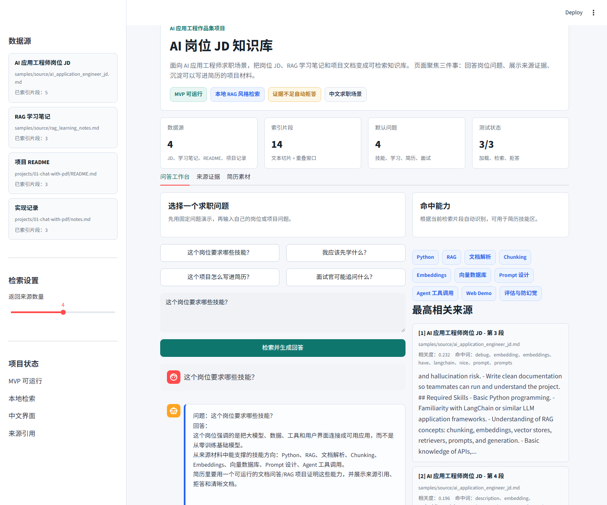

# Project 01: Chat With PDF / AI JD Knowledge Base

## Goal

从一个基础 PDF 问答案例开始，逐步改造成“AI 求职资料问答助手”。

你最终要能解释清楚：

> 用户上传 PDF 后，系统如何把文档变成可检索知识库？用户提问时，系统如何找到相关片段，再让大模型基于片段回答？

## Current MVP

现在已经有一个不依赖 API key 的本地 RAG 风格 MVP：

```text
source documents -> chunks -> TF-IDF retrieval -> grounded answer -> source snippets
```

并新增了一套自编 SQLite 模拟数据库：

```text
roles -> role_skills -> skills -> project_skills -> projects
                         ├── interview_questions
                         └── learning_tasks
```

这套数据库让页面可以查询：

- 哪些模拟岗位最适合当前作品集
- 目标岗位需要哪些技能证据
- 当前项目覆盖了哪些岗位技能
- 下一步应该补哪些学习任务
- 面试官可能围绕哪些技能追问

它默认读取：

- `samples/source/ai_application_engineer_jd.md`
- `samples/source/rag_learning_notes.md`
- `projects/01-chat-with-pdf/README.md`
- `projects/01-chat-with-pdf/notes.md`

可以回答：

- 这个岗位要求哪些技能？
- 我应该先学什么？
- 这个项目怎么写进简历？
- 面试官可能追问什么？

当检索证据不足时，它会拒答，而不是编造答案。

## Demo Preview



## Run

CLI:

```powershell
python projects\01-chat-with-pdf\jd_knowledge_base.py "这个岗位要求哪些技能？" --show-index
```

Streamlit:

```powershell
streamlit run projects\01-chat-with-pdf\app.py
```

Tests:

```powershell
cd projects\01-chat-with-pdf
python test_jd_knowledge_base.py
python test_career_database.py
```

Database:

```powershell
python projects\01-chat-with-pdf\career_database.py --init --query projects --role-id 1
python projects\01-chat-with-pdf\career_database.py --query skills --role-id 1
```

## Resume Value

- 证明你理解 RAG 的完整链路：文档读取、chunking、检索、回答、来源引用、拒答。
- 证明你能设计关系型模拟业务库，并用 SQL 查询岗位、技能、项目和面试题之间的关系。
- 证明你能把岗位 JD 转成一个具体 AI 应用，而不是只停留在概念学习。
- 证明你会写 README、测试和可复现运行命令。

## Task Cards

### Task 1: Run A Minimal Demo

目标：先跑通一个最小 PDF 问答流程。

你需要完成：

- 创建 Python 虚拟环境。
- 安装基础依赖。
- 准备一个测试 PDF。
- 读取 PDF 文本。
- 打印前 500 个字符。

不要一开始就写完整 RAG。

### Task 2: Split Text Into Chunks

状态：已在 `jd_knowledge_base.py` 中实现基础版本。

目标：理解为什么长文档不能直接塞给大模型。

你需要完成：

- 把 PDF 文本切成多个 chunk。
- 打印 chunk 数量。
- 打印第一个 chunk。
- 观察 chunk_size 和 chunk_overlap 的影响。

### Task 3: Create Embeddings

状态：下一步。

目标：理解文本如何变成向量。

你需要完成：

- 配置 API key。
- 调用 embedding 模型。
- 对几个短句生成向量。
- 比较相似句子的检索结果。

### Task 4: Build A Vector Store

状态：下一步。

目标：把 chunk 存入向量数据库。

你需要完成：

- 选择 Chroma 或 FAISS。
- 存入 PDF chunks。
- 根据问题检索 top-k 片段。
- 打印检索到的上下文。

### Task 5: Generate Answers With Sources

状态：MVP 已用模板回答和来源片段实现，后续可接入 LLM。

目标：让 LLM 只基于检索到的上下文回答。

你需要完成：

- 设计 prompt。
- 把检索上下文传给 LLM。
- 回答中显示来源片段。
- 找不到答案时拒答。

## Innovation Direction

基础版完成后，改造成：

**AI Job Description Knowledge Base**

它可以回答：

- 这个岗位要求哪些技能？
- 我现在缺哪些能力？
- 这个 JD 适合放进简历的项目亮点是什么？
- 面试官可能追问什么？

## Interview Talking Points

- 为什么先做本地 TF-IDF MVP：先验证 RAG 流程和来源引用，再替换为 embedding/vector store。
- 为什么需要拒答：当检索片段与问题相关性低时，系统不应该编造答案。
- 下一步怎么升级：接入 OpenAI embeddings、Chroma/FAISS、Streamlit 文件上传和手动评估集。

